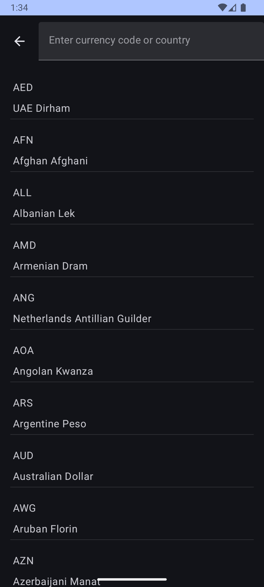

# DevShowcase

A **Jetpack Compose Multiplatform** project showcasing the power of Compose across **Android** and **iOS**. This app is designed to be a portfolio piece, demonstrating best practices in **Kotlin Multiplatform (KMP)** development.

## ✨ Features

- **Currency Converter**: Supports conversion for **161 countries**.
- **Offline-First Approach**: Works even without an internet connection.
- **Compose UI for Android & iOS**: A fully **declarative** UI using Jetpack Compose.
- **More features coming soon!** 🚀

## 🏗️ Tech Stack
- **Kotlin Multiplatform (KMP)**
- **Jetpack Compose Multiplatform**
- **SQLDelight** (for offline storage)
- **Ktor Client** (for API communication)
- **MVVM/MVI Architecture**
- **Dependency Injection** (Koin)
- **Datastore**
- **Compose Navigation**

  
## 📸 Screenshots

Gif for Android and iOS

<div style="display: flex; justify-content: center;">
  
  
</div>

# Android

<div style="display: flex; justify-content: center;">
  
  
  
</div>

<div style="display: flex; justify-content: center;">
  
  
  
</div>

# iOS

<div style="display: flex; justify-content: center;">
  
  
  
</div>

<div style="display: flex; justify-content: center;">
  
  
  
</div>


## 🚀 Getting Started

### Clone the Repository
```sh
git clone https://github.com/privin-dolleth-reyner/DevShowcase.git
cd DevShowcase
```

### Run on Android
```sh
./gradlew androidApp:installDebug
```

### Run on iOS
1. Open `iosApp/iosApp.xcworkspace` in **Xcode**.
2. Select a simulator or connected device.
3. Click **Run**.

---
Made with ❤️ using **Compose Multiplatform**.

